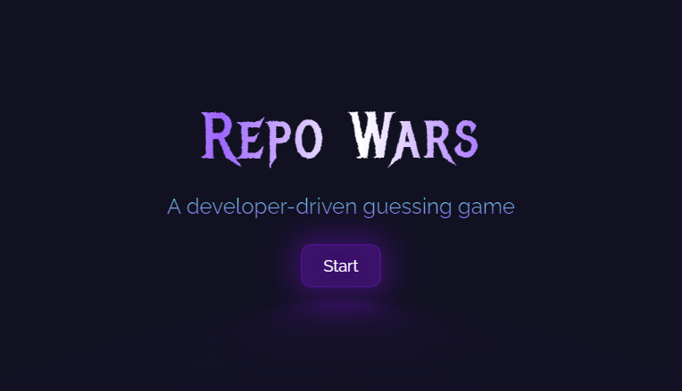

# RepoWars

<p align="center">
  
</p>

This project is a web game created using React, Vite, TypeScript and consuming the public API of GitHub. The game displays all the data of two randomly selected repositories and the user must choose which one has more stars. The design is made with CSS3 modules and custom hooks, and a dedicated client is used to utilize the GitHub API.

---
## Features

- [x] Functional Components in React
- [x] Project Organization using React and TypeScript
- [x] Responsive and Modern Design using CSS3 and CSS modules
- [x] Flexbox and Layout Fundamentals
- [x] Usage of CSS Variables for Theme Creation
- [x] Custom Hooks Creation
- [x] Commits using Conventional Commits
- [x] Typing using TypeScript
- [x] Creation of Utilities

## Live Version
[Repowars](https://repowars-kevincubas.vercel.app/)
## Technologies & tools

This project uses the following tools:

- [React](https://reactjs.org/) and [ReactDOM](https://reactjs.org/docs/react-dom.html) for building the UI
- [TypeScript](https://www.typescriptlang.org/) for typing and safer development
- [Vite](https://vitejs.dev/) for fast development and production builds
- [@octokit/core](https://www.npmjs.com/package/@octokit/core) and [axios](https://axios-http.com/) for communication with the GitHub API
- [react-icons](https://react-icons.github.io/react-icons/) for UI icons

## Instalation Running the project 🏃‍♂️

To use this project, you need to follow these steps:

1. Clone the repository: `git clone https://github.com/kevinCubas/repo-wars.git`
2. Install the dependencies:

```cl
npm install
```
3. Run the application:

```cl
npm run dev
```

Note: This project uses Vite to run locally. Make sure to run the project using `npm run dev` instead of `npm start`.

---

## Contributing

To contribute to this project, please follow these guidelines:

1. Fork the repository
2. Create a new branch: `git checkout -b feature/your-feature-name`
3. Make your changes and commit them using Conventional Commits
4. Push to the branch: `git push origin feature/your-feature-name`
5. Submit a pull request

## License

This project is licensed under the MIT License - see the LICENSE.md file for details.

## Credits

This project was created by [kevinCubas](https://github.com/kevinCubas).
